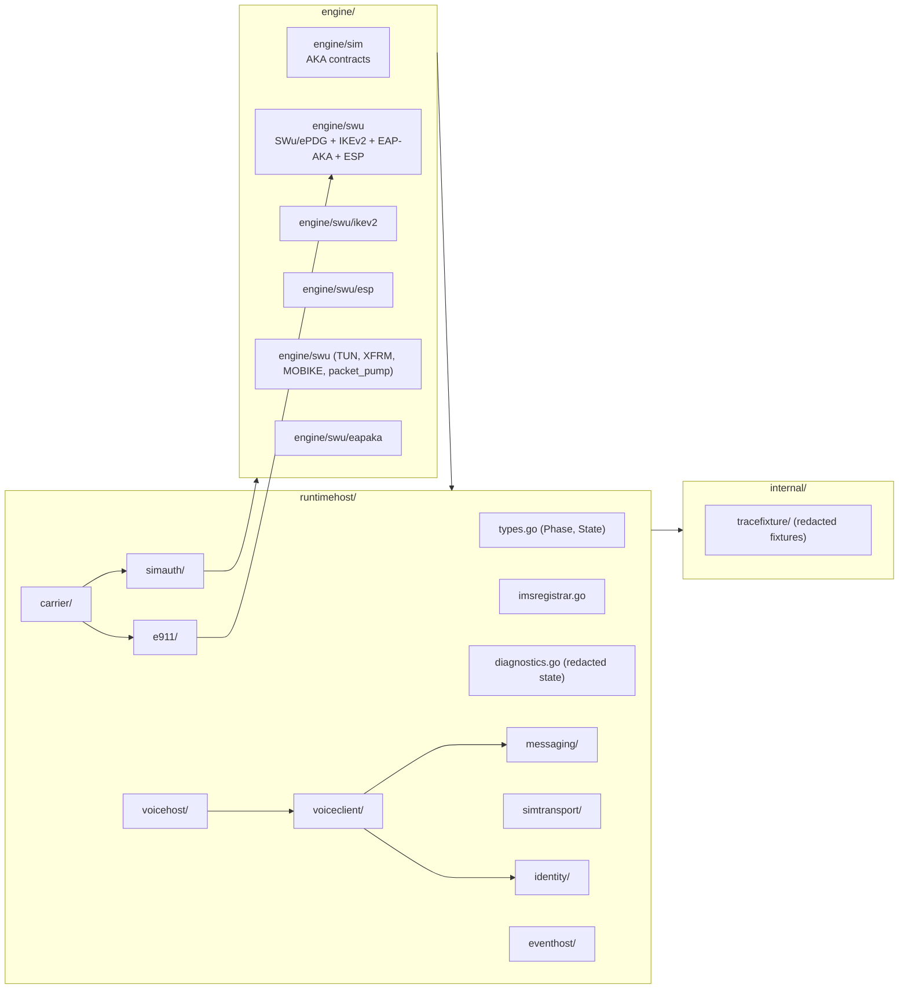
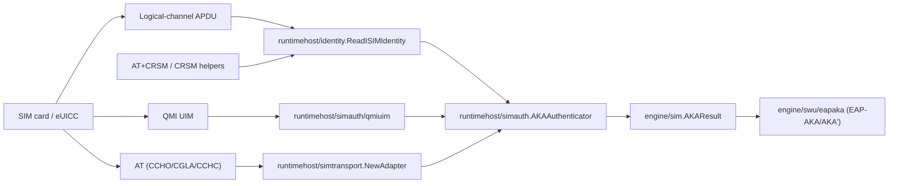
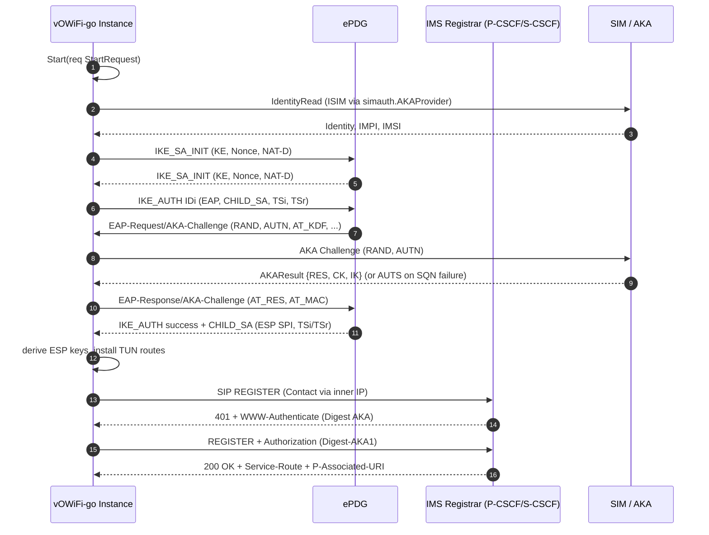
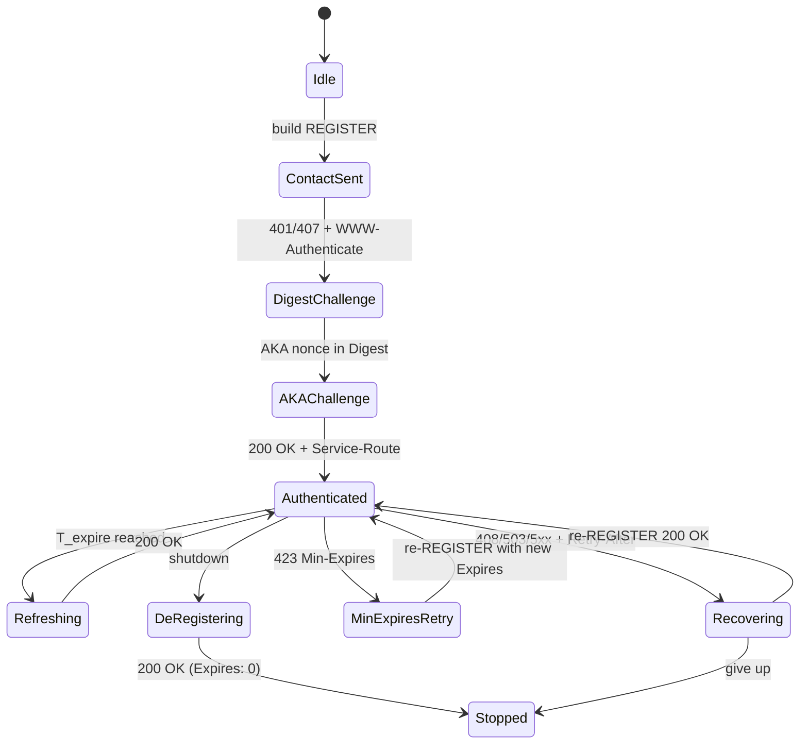
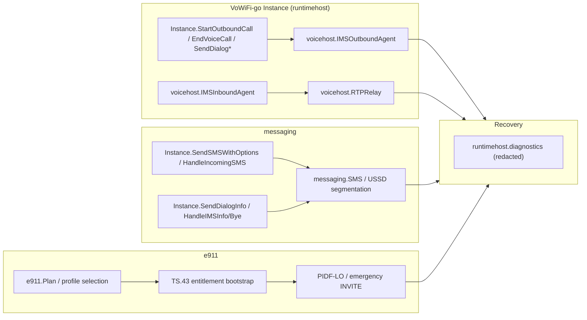

# vowifi-go

A from-scratch, community Go implementation of the VoHive VoWiFi runtime boundary.
vowifi-go reproduces the public APIs and protocol layers that VoHive consumes for
SIM/ISIM AKA, SWu/ePDG tunneling, IMS registration, messaging, voice bridging,
emergency calling, and userspace dataplane experiments. The repository is
intentionally a library — it owns no main service. VoHive supplies the process
boundary; vowifi-go supplies the Go packages that fill it.

> **Status.** vowifi-go is under active development. It is an independent
> implementation — not affiliated with, endorsed by, or a drop-in replacement for
> any vendor, operator, or official closed-source VoWiFi product. Full SIP
> transaction timers, advanced IMS interworking, carrier-specific behaviour,
> production hardening, and real-world compatibility work are still being
> implemented incrementally behind the current APIs.

---

## Table of contents

1. [What this module is](#what-this-module-is)
2. [Status and disclaimer](#status-and-disclaimer)
3. [Quick start](#quick-start)
4. [Repository layout](#repository-layout)
5. [Architecture deep-dive](#architecture-deep-dive)
   - 5.1 [SIM and AKA bridge](#sim-and-aka-bridge)
   - 5.2 [SWu/ePDG and IMS crypto plane](#swuepdg-and-ims-crypto-plane)
   - 5.3 [IMS, voice, messaging, emergency](#ims-voice-messaging-emergency)
   - 5.4 [IMS REGISTER state machine](#ims-register-state-machine)
   - 5.5 [Voice, messaging, emergency dispatch](#voice-messaging-emergency-dispatch)
6. [Public API surface](#public-api-surface)
7. [Integration snippet](#integration-snippet)
8. [Local development and CI](#local-development-and-ci)
9. [Module dependencies and the `replace` directive](#module-dependencies-and-the-replace-directive)
10. [Coverage of major protocol features](#coverage-of-major-protocol-features)
11. [Known gaps and device-trial requirements](#known-gaps-and-device-trial-requirements)
12. [Security, privacy, and compliance](#security-privacy-and-compliance)
13. [Repository rules (developer hygiene)](#repository-rules-developer-hygiene)
14. [Documentation index](#documentation-index)
15. [License and contact](#license-and-contact)

---

## What this module is

`github.com/Starktomy/vowifi-go` is a Go module that VoHive (or any host
process that already manages a modem, SIM slot, and outer IP path) can import to:

- negotiate an SWu/ePDG tunnel with EAP-AKA / EAP-AKA' authentication,
- register and refresh an IMS binding over SIP REGISTER + Digest AKA,
- exchange SMS over IMS `MESSAGE`, run USSD over IMS `INVITE`/`INFO`,
- place and receive MMTel voice calls with SDP / RTP / SRTP media,
- handle E911/TS.43 entitlement and emergency INVITEs with PIDF-LO,
- drive the Linux TUN/XFRM (or userspace) dataplane that carries all of the
  above in userspace.

The project keeps hardware, modem, network, TUN, routing, and command execution
boundaries injectable so the entire test suite runs over loopback without a real
SIM, a real TUN device, or root privileges.

For documentation that goes deeper into a single area:

| Topic | Where it lives |
| --- | --- |
| Implementation inventory | [`docs/FEATURES.md`](docs/FEATURES.md) |
| Architectural overview | [`docs/ARCHITECTURE.md`](docs/ARCHITECTURE.md) |
| Local dev and CI workflow | [`docs/DEVELOPMENT.md`](docs/DEVELOPMENT.md) |
| VoHive readiness gaps | [`docs/VOHIVE_READINESS.md`](docs/VOHIVE_READINESS.md) |
| Coding-agent guide | [`AGENTS.md`](AGENTS.md) |

---

## Status and disclaimer

This project is still under active development and is **not feature-complete**.
APIs, behaviour, compatibility assumptions, and supported scenarios may change as
the implementation evolves.

vowifi-go is a third-party independent open implementation. It is **not**
affiliated with, endorsed by, authorized by, or jointly developed with any mobile
network operator, device vendor, chipset vendor, SIM vendor, ePDG provider, IMS
provider, or official closed-source VoWiFi implementation.

Users are solely responsible for any compliance, regulatory, contractual,
operational, or financial consequence of using or deploying this software. See
the full notice in [`docs/DISCLAIMER.md`](docs/DISCLAIMER.md).

---

## Quick start

Run the full unit test suite from the repository root:

```sh
go test ./...
```

Run the same local CI entry point as GitHub Actions:

```sh
make ci
```

Pull the module into a host program:

```sh
go get github.com/Starktomy/vowifi-go@latest
```

Run the manual old-VoHive compatibility check from a local VoHive checkout:

```sh
VOHIVE_DIR=/path/to/vohive GO=/usr/local/go/bin/go GOFMT=/usr/local/go/bin/gofmt make compat-vohive
```

The local CI path is loopback-only — no real modem, no real TUN device, no root.

---

## Repository layout



The arrows are intended to be read as `depends on at import time`. They are
not sequence-diagram arrows — see §5 for behavior.

---

## Architecture deep-dive

This section is split into three technical sub-sections plus two diagrams that
the rest of the on-ramp nests under. Each subsection names the package and the
file path that owns the responsibility.

### SIM and AKA bridge

`engine/sim` is intentionally a tiny contract package. It defines
`AKAResult{RES,CK,IK,AUTS}`, `AKAAuthRequest{Application,RAND,AUTN}`,
`SyncFailureError`, `MACFailureError`, and three interfaces: `AKAProvider`,
`AKAAuthenticator`, and `ISIMAKAProvider`. Real implementations live in
`runtimehost/simauth` and `engine/swu/eapaka`:

- `runtimehost/simauth/aka.go` wraps a `LogicalChannelTransport` and exposes
  `NewAKAProvider`, `BuildUSIMAuthAPDU`, `ParseUSIMAuthResponse`,
  `ClassifyUSIMAuthResponse`, `ClassifyUSIMAuthExchange`, `ParseAUTS`.
- `runtimehost/simauth/identity.go` carries the EAP-AKA identity helpers —
  `FormatEAPAKAPermanentIdentity`, `FormatEAPAKAPrimePermanentIdentity`,
  `ParseEAPAKAPermanentIdentity`, `DecodeUSIMIMSI`, `EncodeUSIMIMSI`,
  `MNCLengthFromAD`, plus ISIM identity string encode/decode.
- `runtimehost/simauth/apdu.go` and `runtimehost/simtransport/at.go`,
  `runtimehost/simtransport/recovery.go`, `runtimehost/simtransport/status.go`,
  `runtimehost/simauth/hostauth.go`, `runtimehost/simauth/qmiuim.go` carry the
  three hardware-side transport paths (logical-channel APDU, AT `CCHO`/`CGLA`,
  QMI UIM).
- `engine/swu/eapaka` reuses the AKA response shape (`RES`/`CK`/`IK`/`AUTS`)
  to feed EAP-AKA / EAP-AKA' attribute encoding on the IKE_AUTH exchange.



### SWu/ePDG and IMS crypto plane

`engine/swu` is the largest single package and is where the wireless-side
cryptography lives. Sub-packages:

- `engine/swu/ikev2` — IKEv2 packet layer. Builds IKE_SA_INIT, IKE_AUTH,
  CREATE_CHILD_SA, INFORMATIONAL, and MOBIKE UPDATE_SA_ADDRESSES packets;
  derives `SK_*` keys from SKEYSEED; understands proposals / transforms /
  KE / Nonce / IDi / IDr / AUTH / CP / TS / Notify / Delete / EAP; supports
  combined-mode AES-GCM proposals. Also routes encrypted INFORMATIONAL/DPD
  payloads, runs encrypted IKE_AUTH EAP-Identity, and orchestrates full
  EAP-AKA / EAP-AKA' flows over IKE_AUTH.
- `engine/swu/eapaka` — EAP-AKA / EAP-AKA' attribute codec. AT_BIDDING
  downgrade protection, AT_RAND / AT_AUTN / AT_MAC / AT_RES / AT_AUTS,
  AT_KDF, AT_CHECKCODE, AT_NOTIFICATION, AT_CLIENT_ERROR, full / pseudonym /
  reauthentication identity selection.
- `engine/swu/esp` — ESP seal/open primitives for userspace dataplane.
  AES-CBC + HMAC-SHA integrity or combined-mode AES-GCM-16, RFC 4303 padding,
  anti-replay window.
- `engine/swu/{tun_linux.go, tun_unsupported.go, tun_routing.go,
  tun_tunnel_manager.go, xfrm.go, packet_pump.go, packet_session.go,
  udp_esp_transport.go, kernel_session.go}` — Linux TUN device plumbing,
  XFRM/IPsec state install, the userspace packet pump that bridges TUN
  inner IP to ESP outer UDP, and MOBIKE triggers.
- `engine/swu/{ike_tunnel_manager.go, ike_control.go, ike_liveness.go,
  eap_reauth.go, mobike_state.go}` — top-level tunnel-manager types:
  `swu.NewIKEPacketTunnelManager`, `swu.NewTUNIKETunnelManager`, and the
  `swu.EAPReauthenticationState` hook.
- The single entry `engine/swu/swu.go` exports `TunnelConfig`, `ProxyConfig`,
  `IMSIdentity`, `DataplaneMode{Disabled, Userspace, Kernel}`, plus
  `TunnelManager`, `TunnelSession`, `TunnelResult`, `MOBIKERequest`, and
  `NewTraceID`-style helpers.



### IMS, voice, messaging, emergency

- `runtimehost/voiceclient/` — the SIP client side. Owns REGISTER headers,
  WWW-Authenticate parsing, AKA nonce extraction, Digest MD5/MD5-sess/
  SHA-256/SHA-512-256 plus AKAv1-MD5 / AKAv2-MD5 authorizers,
  `Security-Client` proposal generation, `Security-Server` selection,
  `RegistrationRecoveryAction` and `RegistrationRecoveryPlan` planning. The
  interaction with the SIP REGISTER state machine is documented in `docs/*`.
  Voice-client sub-functions exported for consumers: `ParseWWWAuthenticate`,
  `ParseDigestAuthorization`, `VerifyDigestAuthorization`,
  `ExtractAKAChallengeNonce`, `BuildDigestAuthorization`,
  `BuildAKADigestPassword`, `BuildRegisterHeaders`,
  `ParseRegistrationFailureInfo`, `PlanRegistrationRecovery`.
- `runtimehost/voicehost/` — the SIP server / dialog side. SIP dialog
  helpers (`OutboundCallAgent`, `DialogTerminator`, `DialogCanceller`,
  `DialogInfoSender`, `DialogMessageSender`, `DialogPrackSender`,
  `DialogOptionsSender`, `DialogReferSender`, `DialogNotifySender`,
  `DialogSubscribeSender`, `DialogUpdater`, `DialogReinviter`,
  `DialogHoldController`, `DialogRTPDTMFSender`), SDP rewrite, RTP/RTCP
  relay, DTMF (RFC 2833 / SIP INFO / auto-relay).
- `runtimehost/messaging/` — SMS and USSD. IMS `MESSAGE` transport hooks,
  inbound SMS, delivery report matching, CPIM/3GPP SMS/IMDN payload
  unpacking, SMS segmentation (`SegmentSMS`, `SegmentSMSWithOptions`),
  SMS PDU assembly, UCS2/GSM-7/NLI handling, USSD XML and dialog
  transports. The package exports `NewService`, `SMSTransport`,
  `USSDTransport`, `DeliveryStore`, `IMSMessagingRetryStore`,
  `IMSMessagingRetryDueStore`, `IMSMessagingRetryReplayResult`,
  `SendOptions`, `SendOutcome`, `RPCauseText`.
- `runtimehost/e911/` — TS.43-style entitlement bootstrap, JSON/XML
  emergency address parsing, HTTP Digest AKA retry for entitlement
  challenges, PIDF-LO (`multipart/related` body + `cid:` Geolocation),
  emergency service URN mapping. Exposes `NewDefaultHTTPClient`, an
  injectable `HTTPClient` interface, `HTTPRequest`/`HTTPResponse`.
- `runtimehost/carrier/` — per-carrier `CarrierPolicy`, P-CSCF profile
  selection, IMS realm selection, VoWiFi blocked-MCC classification, and
  AT&T TS.43/E911 presets. Exposes `LoadCarrierOverrides`,
  `ClearCarrierOverrides`, `ResolveEffectiveCarrierConfig`,
  `NormalizeSubscriberProfile`, `IMSAccessProfileForSubscriber`,
  `CarrierPolicyForSubscriber`, `CarrierPolicyForConfig`,
  `PlanIMSRegistration`, `IsVoWiFiBlockedMCC`, `DefaultIMSRealm`,
  `DefaultPrivateIdentityRealm`, `DefaultNAIRealm`.
- `runtimehost/eventhost/` — internal pub-sub. Exposes `Dispatcher`,
  `RuntimeStateSnapshot`, `SMSReceived`, `SMSSent`, `USSDUpdated`,
  `LocalNumberLearned`, `LogNotify`.
- `runtimehost/diagnostics.go` — redacted snapshot projections:
  `SafeDiagnosticState`, `SafeDiagnosticIMSRegistrationResult`,
  `SafeDiagnosticIMSRegistrationRecoveryState`,
  `SafeDiagnosticIMSRegisterResponseDecision`, `SafeDiagnosticString`,
  `SafeDiagnosticError`. Every VoHive-facing diagnostic shape is built
  through these helpers.
- `runtimehost/types.go` — top-level lifecycle types: `Phase{Starting,
  SIMReady, Ready, Stopped, Error}`, `State`, `Event`, `Observer`,
  `ObserverFunc`, `Modem`, `APDUAccess`, `IdentityReader`, `CRSMAccess`,
  `ModemAccess`, `SIMAdapter`, `SessionConfig`, `IMSRegistrationConfig`,
  `IMSRegistrationResult`, `IMSRegistrationRecoveryState`, `IMSRegistrar`,
  `StartRequest`, and the `Instance` returned from `Start(ctx, req)`.



### Voice, messaging, emergency dispatch



---

## Public API surface

| Concern | Entry point(s) | File |
| --- | --- | --- |
| Lifecycle | `runtimehost.Start`, `(*Instance).Stop`, `(*Instance).State`, `(*Instance).DiagnosticState`, `(*Instance).Status`, `(*Instance).Obs`, `runtimehost.NewTraceID`, `runtimehost.WithTraceID`, `runtimehost.SetLogger` | `runtimehost/types.go`, `runtimehost/diagnostics.go` |
| IMS registration | `runtimehost.IMSRegistrar`, `IMSRegisterTransportFactory`, `IMSVoiceTransportFactory`, `IMSSMSTransportFactory`, `IMSUSSDTransportFactory` | `runtimehost/imsregistrar.go` |
| SIP header / Digest / Sec-Agree | `voiceclient.ParseWWWAuthenticate`, `voiceclient.ParseDigestAuthorization`, `voiceclient.VerifyDigestAuthorization`, `voiceclient.ExtractAKAChallengeNonce`, `voiceclient.BuildDigestAuthorization`, `voiceclient.BuildAKADigestPassword`, `voiceclient.BuildRegisterHeaders`, `voiceclient.ParseRegistrationFailureInfo`, `voiceclient.PlanRegistrationRecovery`, `voiceclient.IMSProfile`, `voiceclient.SIPRegisterTransport` | `runtimehost/voiceclient/voiceclient.go` |
| Voice dialogs | `voicehost.Agent`, `voicehost.OutboundCallAgent`, `voicehost.DialogTerminator*`, `voicehost.DialogInfoSender`, `voicehost.DialogMessageSender`, `voicehost.DialogPrackSender`, `voicehost.DialogOptionsSender`, `voicehost.DialogReferSender`, `voicehost.DialogNotifySender`, `voicehost.DialogSubscribeSender`, `voicehost.DialogUpdater`, `voicehost.DialogReinviter`, `voicehost.DialogHoldController`, `voicehost.DialogRTPDTMFSender` | `runtimehost/voicehost/voicehost.go` |
| SMS / USSD | `messaging.NewService`, `messaging.SegmentSMS`, `messaging.SegmentSMSWithOptions`, `messaging.SMSTransport`, `messaging.USSDTransport`, `messaging.DeliveryStore`, `messaging.IMSMessagingRetryStore`, `messaging.IMSMessagingRetryDueStore`, `messaging.RPCauseText`, `messaging.WithSuppressSendTGSuccess`, `messaging.SendOptions`, `messaging.SendOutcome`, `messaging.IncomingSMS`, `messaging.SMSDeliveryReport` | `runtimehost/messaging/messaging.go` |
| E911 / TS.43 | `e911.NewDefaultHTTPClient`, `e911.HTTPClient`, `e911.HTTPRequest`, `e911.HTTPResponse` | `runtimehost/e911/e911.go` |
| Carrier presets | `carrier.LoadCarrierOverrides`, `carrier.ClearCarrierOverrides`, `carrier.ResolveEffectiveCarrierConfig`, `carrier.NormalizeSubscriberProfile`, `carrier.IMSAccessProfileForSubscriber`, `carrier.CarrierPolicyForSubscriber`, `carrier.CarrierPolicyForConfig`, `carrier.PlanIMSRegistration`, `carrier.IsVoWiFiBlockedMCC`, `carrier.DefaultIMSRealm`, `carrier.DefaultPrivateIdentityRealm`, `carrier.DefaultNAIRealm`, `carrier.SubscriberProfile`, `carrier.CarrierPolicy`, `carrier.IMSRegistrationPlan` | `runtimehost/carrier/carrier.go` |
| SIM / AKA contracts | `sim.AKAResult`, `sim.AKAAuthRequest`, `sim.SyncFailureError`, `sim.MACFailureError`, `sim.AKAProvider`, `sim.AKAAuthenticator`, `sim.ISIMAKAProvider`, `sim.AKAApplication` | `engine/sim/sim.go` |
| SIM / AKA implementations | `simauth.NewAKAProvider`, `simauth.BuildUSIMAuthAPDU`, `simauth.ParseUSIMAuthResponse`, `simauth.ClassifyUSIMAuthResponse`, `simauth.ClassifyUSIMAuthExchange`, `simauth.ParseAUTS`, `simauth.FormatEAPAKAPermanentIdentity`, `simauth.FormatEAPAKAPrimePermanentIdentity`, `simauth.ParseEAPAKAPermanentIdentity`, `simauth.DecodeUSIMIMSI`, `simauth.EncodeUSIMIMSI`, `simauth.MNCLengthFromAD`, `simauth.DecodeISIMIdentityString`, `simauth.EncodeISIMIdentityString`, `simauth.PadISIMIdentityRecord` | `runtimehost/simauth/{aka.go, identity.go}` |
| SWu / ePDG | `swu.TunnelManager`, `swu.NewIKEPacketTunnelManager`, `swu.NewTUNIKETunnelManager`, `swu.MOBIKERequest`, `swu.EAPReauthenticationState`, `swu.EPDGRouteExclusion`, `swu.TUNRoute`, `swu.TUNRule`, `swu.DataplaneMode{Disabled,Userspace,Kernel}` | `engine/swu/{swu.go, ike_tunnel_manager.go, tun_tunnel_manager.go, mobike_state.go, ...}` |
| IKEv2 packet layer | `engine/swu/ikev2` (build-only IKEv2 packet codec plus full IKE_SA_INIT / IKE_AUTH / CREATE_CHILD_SA / INFORMATIONAL / MOBIKE exchange runners) | `engine/swu/ikev2/*.go` |
| ESP seal/open | `engine/swu/esp` (AES-CBC + HMAC-SHA, AES-GCM-16, anti-replay) | `engine/swu/esp/esp.go` |
| Dataplane | `swu.XFRM`, `swu.TUNDeviceConfig`, `swu.TUNTunnelManagerConfig`, `swu.PacketPump`, `swu.UDPESPTransport`, `swu.MOBIKEState` | `engine/swu/{xfrm.go, tun_*.go, packet_pump.go, udp_esp_transport.go, ...}` |
| Identity | `identity.Identity`, `identity.Profile`, `identity.PreparedSession`, `identity.ReadISIMIdentity`, `identity.ReadISIMIdentityCRSM`, `identity.ExtractIMEI`, `identity.AKAAppPreference*` | `runtimehost/identity/{identity.go, recovery.go}` |
| Event host | `eventhost.Dispatcher`, `eventhost.RuntimeStateSnapshot`, `eventhost.SMSReceived`, `eventhost.SMSSent`, `eventhost.USSDUpdated`, `eventhost.LocalNumberLearned`, `eventhost.LogNotify` | `runtimehost/eventhost/eventhost.go` |
| Trace fixtures (re-importer only) | `tracefixture.NewRedactor`, `tracefixture.RedactString`, `tracefixture.RedactBytes`, `tracefixture.RedactSIPString`, `tracefixture.RedactLines`, `tracefixture.Transcript`, `tracefixture.ParseTranscriptJSON`, `tracefixture.ParseAndRedactTranscriptJSON`, `tracefixture.ValidateTranscript`, `tracefixture.RedactTranscript`, `tracefixture.ValidateTranscriptRedaction` | `internal/tracefixture/{redactor.go, transcript.go}` |

> Only exported symbols that have already shipped in the current commit are
> listed. New entry points that surface during incremental implementation will
> be added here on the next README pass.

---

## Integration snippet

This is a wire-format level sketch — it shows how a host program feeds the
runtime with a SIM AKA provider and a SIP register transport, and then watches
the lifecycle state. VoHive wraps this with its own bootstrap; new hosts can
copy the shape.

```go
ctx := context.Background()

// 1. SIM identity + AKA provider (real modem, test stub, or QMI UIM).
aka := simauth.NewAKAProvider(logicalChannelTransport)
simAdapter := runtimehost.NewReaderSIMAdapter(aka)
modemAccess := runtimehost.NewModemAccessAdapterWithRecovery(modem, runtimehost.SIMAccessRecoveryOptions{
    AllowVendorSpecific: true,
})

// 2. Carrier-derived policy.
policy, err := carrier.PlanIMSRegistration(carrier.IMSRegistrationPlanInput{
    IMSI:   imsi,
    MCC:    mcc,
    MNC:    mnc,
})
if err != nil { /* fall back to default policy or block */ }

// 3. IMS registrar built locally or supplied by VoHive.
registrar := runtimehost.IMSRegistrar(myIMSCtor)

// 4. Dataplane mode — `swu.DataplaneModeUserspace` is the loopback-friendly
//    default; `swu.DataplaneModeKernel` requires root or CAP_NET_ADMIN.
inst, err := runtimehost.Start(ctx, runtimehost.StartRequest{
    DeviceID:    deviceID,
    Profile:     identity.Profile{IMSI: imsi, MCC: mcc, MNC: mnc},
    Prepared:    preparedSession,
    Dataplane:   runtimehost.DataplanePolicy{Mode: swu.DataplaneModeUserspace},
    SIM:         simAdapter,
    Access:      modemAccess,
    IMSRegistrar: registrar,
    NetworkMode: "LTE",
    VoiceUserAgent: "vowifi-go/0.1",
})
if err != nil { return err }
defer inst.Stop(context.Background())

// 5. Observe lifecycle.
inst.AddObserver(runtimehost.ObserverFunc(func(ctx context.Context, ev runtimehost.Event) {
    switch ev.State.Phase {
    case runtimehost.PhaseReady:
        // voice, SMS, USSD transports now exist; begin using them.
    case runtimehost.PhaseError:
        // ev.State.LastReason carries a redacted string.
    }
}))

// 6. Drive work later.
out, err := inst.SendSMSWithOptions(ctx, "+15555550100", "hi", messaging.SendOptions{})
_ = out; _ = err
```

The above deliberately uses only symbols documented in
[§6 Public API surface](#public-api-surface).

---

## Local development and CI

### Local commands

```sh
make help         # list all targets
make ci           # default CI (version + module path + hygiene + tidy + vet + smoke + test)
make go-version
make module-path
make hygiene-check
make privacy-check
make download
make fmt-check
make tidy-check
make vet
make smoke
make test
make race         # opt-in
make coverage     # opt-in
make compat-vohive        # against a local VoHive checkout
make compat-vohive-selftest
```

If `go` / `gofmt` is not on `PATH`, pass the absolute path:

```sh
GO=/usr/local/go/bin/go GOFMT=/usr/local/go/bin/gofmt make ci
```

### GitHub Actions

`.github/workflows/ci.yml` runs Ubuntu against both the minimum Go patch
required by `go.mod` and the latest patch in that minor line, calling
`make ci` so local validation matches the default CI job. The workflow can
also be started manually with optional race and coverage inputs that mirror
`make race` / `make coverage`.

The manual `.github/workflows/vohive-compat.yml` workflow checks this module
against an older VoHive consumer checkout. The script clones or copies the
VoHive checkout into a temporary directory, first verifies this checkout still
declares `github.com/Starktomy/vowifi-go` and does not use the legacy module
path in Go module / source files, rewrites legacy `vowifi-go` module
references to `github.com/Starktomy/vowifi-go` when needed, verifies no legacy
module references remain, confirms only the temporary VoHive module resolves
`github.com/Starktomy/vowifi-go` through a `replace` pointing at this
repository, then runs the focused VoHive test set. The source VoHive checkout
is not modified.

Override `VOHIVE_COMPAT_PACKAGES`, `VOHIVE_COMPAT_RUN`,
`VOHIVE_COMPAT_BUILD_PACKAGES`, `VOHIVE_COMPAT_TMPDIR`, `VOWIFI_MODULE`, or
`VOWIFI_COMPAT_LEGACY_BASE` to broaden coverage as needed.

---

## Module dependencies and the `replace` directive

`go.mod` pins:

- `github.com/Starktomy/vowifi-go` — this module (the canonical name).
- `github.com/emiago/sipgo` — SIP client/server transport foundation.
- `github.com/pion/rtcp`, `github.com/pion/srtp/v3` — RTP/RTCP/SRTP media transport.
- `golang.org/x/sys` — Linux system calls.
  `github.com/Starktomy/netlink`, `golang.org/x/sys`, `golang.org/x/sync`,
  `golang.org/x/time`, and several indirect packages.

CI runs the `module-path` guard on every commit to catch any drift in
`module github.com/.../...` declarations.

---

## Coverage of major protocol features

Each row names a protocol area, the public surface that owns it, and the spec
it targets. For long-form inventory, see [`docs/FEATURES.md`](docs/FEATURES.md).

| Protocol area | Owning package(s) | Spec target |
| --- | --- | --- |
| SIM AKA (USIM / ISIM) | `engine/sim`, `runtimehost/simauth`, `engine/swu/eapaka` | 3GPP TS 33.102, TS 31.102 |
| SIM APDU / AT / QMI UIM | `runtimehost/simtransport`, `runtimehost/simauth` | ETSI TS 102 221, 3GPP TS 27.005 / 27.007, Qualcomm QMI |
| IKEv2 / EAP-AKA / EAP-AKA' | `engine/swu/ikev2`, `engine/swu/eapaka` | RFC 7296, RFC 5448, RFC 4186 / RFC 4187 |
| ESP / userspace dataplane | `engine/swu/esp`, `engine/swu/{tun_*, xfrm, packet_pump}` | RFC 4303, RFC 3948 (NAT-T) |
| IMS REGISTER / Digest / AKA | `runtimehost/voiceclient`, `runtimehost/imsregistrar`, `runtimehost/e911` | RFC 3261, RFC 8760 (AKA'), TS 33.203 |
| Security-Verify / Sec-Agree | `runtimehost/voiceclient` | 3GPP TS 33.203 |
| SMS over IMS / USSD | `runtimehost/messaging` | RFC 3428, RFC 4975, RFC 4976, 3GPP TS 24.011 / 24.341 |
| Voice (SIP / SDP / RTP / SRTP) | `runtimehost/voicehost` | RFC 3261 / 3264 / 3550 / 3551 / 3711, 3GPP TS 26.114 |
| E911 / TS.43 | `runtimehost/e911` | AT&T TS.43, NENA i3, RFC 6442 / RFC 8145 / RFC 7859 (Geopriv / PIDF-LO) |
| Diagnostic redaction | `runtimehost/diagnostics`, `internal/tracefixture` | project policy, GDPR-aware logging |
| VoHive compatibility harness | `scripts/compat-vohive.sh`, `.github/workflows/vohive-compat.yml` | wire-level integration test |

---

## Known gaps and device-trial requirements

The project explicitly does **not** claim full parity with the official
closed-source VoWiFi implementation. The current gaps that block production
use are listed in [`docs/VOHIVE_READINESS.md`](docs/VOHIVE_READINESS.md)
across four readiness levels:

1. Compile-compatible.
2. Loopback-functional.
3. Device-functional.
4. Production-ready.

Concretely, current open work that is **not yet proven on real devices** is
highlighted in that document under the readiness matrix and the P0 list. The
README does not duplicate the matrix — read `docs/VOHIVE_READINESS.md` for
the canonical gap inventory.

---

## Security, privacy, and compliance

The repository enforces a privacy guard on tracked worktree content through
`scripts/ci.sh` and `make hygiene-check` / `make privacy-check`. Forbidden
content includes personal email addresses, local home paths, legacy module
references, and `vowifi-go` identifiers that should now read
`github.com/Starktomy/vowifi-go`.

> **Git author and committer metadata are intentional and preserved.** The
> `AGENTS.md` policy explicitly forbids rewrites of `.git` author / committer
> metadata as part of privacy cleanup. Adjust the local Git identity through
> `git config user.name` / `user.email` if it is wrong, but never rewrite
> existing commit history.

Every diagnostic shape that crosses the VoHive boundary is funneled through
`runtimehost/diagnostics.go`'s `Safe*` helpers, which strip the kinds of
material that are unsafe to leak in operator-facing logs (subscriber IDs,
keys, nonces, raw APDU bodies, internal IP / MAC addresses, local paths).

Read the full notice in [`docs/DISCLAIMER.md`](docs/DISCLAIMER.md).

---

## Repository rules (developer hygiene)

`AGENTS.md` is the standing guide for AI coding agents and human contributors
working in this repository. It pins:

- Keep public APIs stable unless a breaking change is explicitly approved.
- Prefer real protocol behaviour over mock-only surface compatibility.
- Inject hardware, modem, network, TUN, route, and command boundaries so CI
  remains loopback-friendly.
- Treat operator-specific behaviour as explicit compatibility work — no
  carrier flow should be assumed complete without tests or real-device
  evidence.
- Validate with `make ci` before committing meaningful changes and run
  `make compat-vohive-selftest` (and the manual `vohive-compat.yml`
  workflow) when changing public runtime behaviour.
- Push after committing when the user explicitly asks.
- Never revert unrelated local changes.

---

## Documentation index

| Document | Purpose |
| --- | --- |
| [`README.md`](README.md) | This document — integrated on-ramp. |
| [`README.zh-CN.md`](README.zh-CN.md) | Chinese mirror of this README. |
| [`docs/ARCHITECTURE.md`](docs/ARCHITECTURE.md) | Package map, runtime boundaries, high-level flow. |
| [`docs/FEATURES.md`](docs/FEATURES.md) | Detailed implementation inventory and known gaps. |
| [`docs/DEVELOPMENT.md`](docs/DEVELOPMENT.md) | Local and CI workflow, VoHive compatibility check. |
| [`docs/VOHIVE_READINESS.md`](docs/VOHIVE_READINESS.md) | Readiness levels, gap matrix, P0 list. |
| [`docs/DISCLAIMER.md`](docs/DISCLAIMER.md) | English disclaimer. |
| [`docs/DISCLAIMER.zh-CN.md`](docs/DISCLAIMER.zh-CN.md) | Chinese disclaimer. |
| [`AGENTS.md`](AGENTS.md) | Coding-agent guide, developer-hygiene rules, Git-identity rules. |
| [`Makefile`](Makefile) | All Make targets. |

---

## License and contact

See [`docs/DISCLAIMER.md`](docs/DISCLAIMER.md) for licensing, warranty, and
liability terms. Issues, questions, or coordination requests should be
opened on the project's public issue tracker; maintainer contact information
is listed in the repository's profile.
