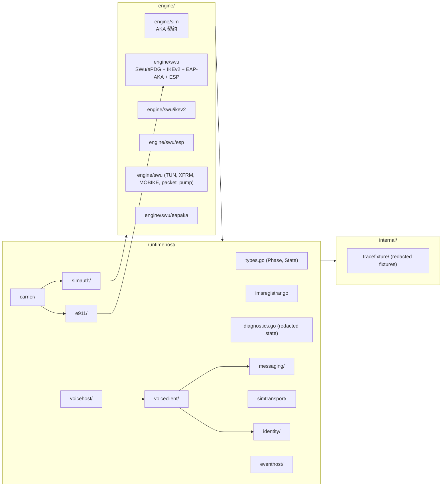
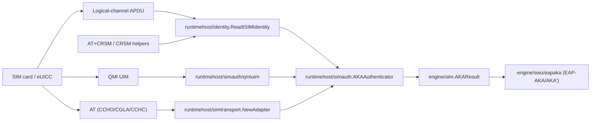
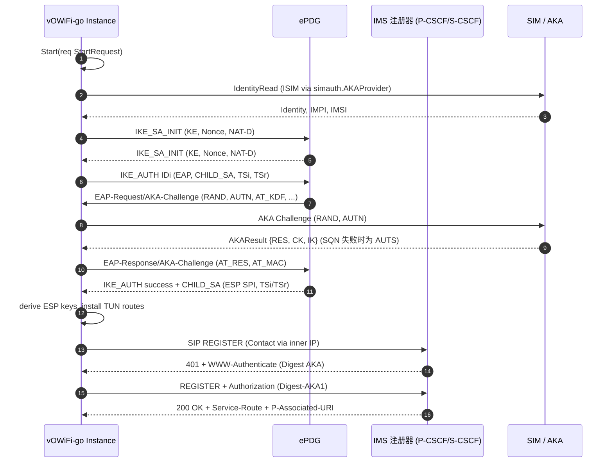
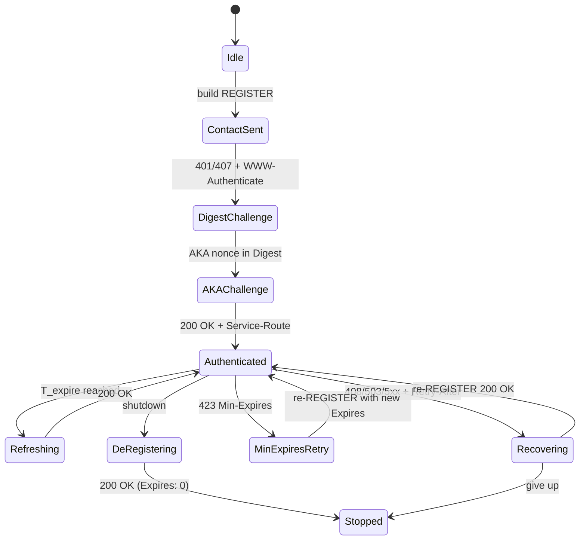
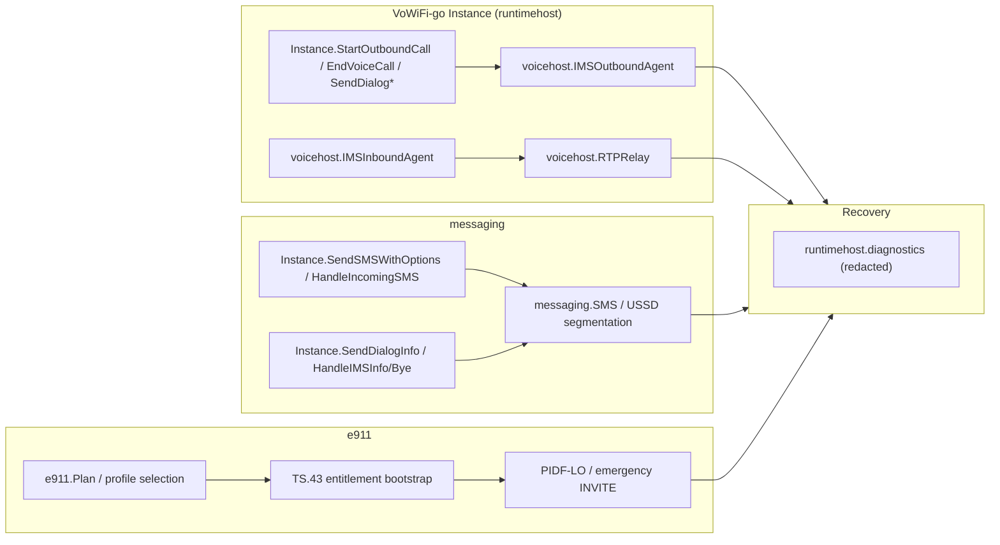

# vowifi-go

vowifi-go 是一个从零编写的、社区维护的 Go 实现，针对 VoHive 的 VoWiFi 运行时边界。
vowifi-go 重现了 VoHive 在 SIM/ISIM AKA、SWu/ePDG 隧道、IMS 注册、消息、语音桥接、
紧急呼叫以及用户态数据平面等场景下所依赖的公共 API 与协议层。本仓库刻意保持为一个
Go 库——并不提供 main 程序；VoHive 提供进程边界，vowifi-go 提供填补该边界的 Go 包。

> **状态说明。** vowifi-go 仍在积极开发中。它是一份独立实现——不隶属于、不被任何
> 厂商、运营商或官方闭源 VoWiFi 产品背书，也不是其替代品。完整的 SIP 事务定时器、
> 高级 IMS 功能互通、运营商特定行为、生产级加固以及真实网络兼容性工作，仍在当前
> API 背后按增量方式演进。

本页是 [`README.md`](README.md) 的中文翻译版本。**项目默认文档以英文为准**；
中英文表述存在差异时，请以英文版为准。

---

## 目录

1. [本模块定位](#本模块定位)
2. [状态与免责声明](#状态与免责声明)
3. [快速开始](#快速开始)
4. [仓库布局](#仓库布局)
5. [架构深度剖析](#架构深度剖析)
   - 5.1 [SIM 与 AKA 桥](#sim-与-aka-桥)
   - 5.2 [SWu/ePDG 与 IMS 密码面](#swuepdg-与-ims-密码面)
   - 5.3 [IMS、语音、消息与紧急呼叫](#ims语音消息与紧急呼叫)
   - 5.4 [IMS REGISTER 状态机](#ims-register-状态机)
   - 5.5 [语音、消息与紧急呼叫派发](#语音消息与紧急呼叫派发)
6. [公共 API 清单](#公共-api-清单)
7. [集成示例](#集成示例)
8. [本地开发与 CI](#本地开发与-ci)
9. [模块依赖与 `replace` 指令](#模块依赖与-replace-指令)
10. [主要协议能力覆盖](#主要协议能力覆盖)
11. [已知缺口与设备测试要求](#已知缺口与设备测试要求)
12. [安全、隐私与合规](#安全隐私与合规)
13. [仓库规则（开发者卫生）](#仓库规则开发者卫生)
14. [文档索引](#文档索引)
15. [许可与联系](#许可与联系)

---

## 本模块定位

`github.com/Starktomy/vowifi-go` 是一个 Go 模块，VoHive（或任何已经管理着调制解调器、
SIM 卡槽和外网 IP 路径的宿主进程）可以导入它来：

- 通过 EAP-AKA / EAP-AKA' 完成 SWu/ePDG 隧道协商；
- 通过 SIP REGISTER + Digest AKA 完成 IMS 绑定注册和刷新；
- 在 IMS `MESSAGE` 上收发 SMS、在 IMS `INVITE`/`INFO` 上跑 USSD；
- 拨打与接听带 SDP / RTP / SRTP 媒体的 MMTel 语音电话；
- 处理 E911/TS.43 授权与带 PIDF-LO 的紧急 INVITE；
- 驱动承载上述全部流量的 Linux TUN/XFRM（或用户态）数据平面。

项目把硬件、调制解调器、网络、TUN、路由与命令执行边界做成可注入的形式，因此整套
测试可以在 loopback 下运行，无需真实 SIM、真实 TUN 设备，也无需 root 权限。

如果想深入某一领域：

| 主题 | 文档位置 |
| --- | --- |
| 实现清单 | [`docs/FEATURES.md`](docs/FEATURES.md) |
| 架构总览 | [`docs/ARCHITECTURE.md`](docs/ARCHITECTURE.md) |
| 本地开发与 CI | [`docs/DEVELOPMENT.md`](docs/DEVELOPMENT.md) |
| VoHive 准备度差距 | [`docs/VOHIVE_READINESS.md`](docs/VOHIVE_READINESS.md) |
| 编码 Agent 指南 | [`AGENTS.md`](AGENTS.md) |

---

## 状态与免责声明

本项目仍在积极开发中，**尚未达到功能完整**。API、行为、兼容性假设与支持场景可能
随实现演进而变动。

vowifi-go 是独立第三方开源实现，**不隶属于、不被任何**移动网络运营商、设备厂商、
芯片厂商、SIM 厂商、ePDG 服务方、IMS 服务方或官方闭源 VoWiFi 实现
**授权、背书、合作或共同开发**。

使用者应自行承担因使用或部署本软件而产生的合规、监管、合同、运营或经济后果。
完整说明见 [`docs/DISCLAIMER.md`](docs/DISCLAIMER.md)，
中文版见 [`docs/DISCLAIMER.zh-CN.md`](docs/DISCLAIMER.zh-CN.md)。

---

## 快速开始

在仓库根目录运行完整单元测试：

```sh
go test ./...
```

运行与 GitHub Actions 完全一致的本地 CI 入口：

```sh
make ci
```

将模块引入宿主程序：

```sh
go get github.com/Starktomy/vowifi-go@latest
```

基于本地 VoHive 检出运行旧版本兼容检查：

```sh
VOHIVE_DIR=/path/to/vohive GO=/usr/local/go/bin/go GOFMT=/usr/local/go/bin/gofmt make compat-vohive
```

本地 CI 路径完全 loopback——不需要真实调制解调器、真实 TUN 设备或 root 权限。

---

## 仓库布局



箭头表示**导入时依赖**，而不是时序箭头——详见 §5 中的行为图。

---

## 架构深度剖析

本节分为三个技术小节加两张 mermaid 图。每个小节都注明承担相应职责的包与文件路径。

### SIM 与 AKA 桥

`engine/sim` 是一个刻意做得很小的“契约包”。它定义了
`AKAResult{RES,CK,IK,AUTS}`、`AKAAuthRequest{Application,RAND,AUTN}`、
`SyncFailureError`、`MACFailureError`，以及三个接口：`AKAProvider`、
`AKAAuthenticator` 与 `ISIMAKAProvider`。真实实现位于
`runtimehost/simauth` 与 `engine/swu/eapaka`：

- `runtimehost/simauth/aka.go` 包封 `LogicalChannelTransport`，对外暴露
  `NewAKAProvider`、`BuildUSIMAuthAPDU`、`ParseUSIMAuthResponse`、
  `ClassifyUSIMAuthResponse`、`ClassifyUSIMAuthExchange`、`ParseAUTS`。
- `runtimehost/simauth/identity.go` 承载 EAP-AKA 身份相关的辅助函数：
  `FormatEAPAKAPermanentIdentity`、`FormatEAPAKAPrimePermanentIdentity`、
  `ParseEAPAKAPermanentIdentity`、`DecodeUSIMIMSI`、`EncodeUSIMIMSI`、
  `MNCLengthFromAD`，以及 ISIM 身份字符串编解码。
- `runtimehost/simauth/apdu.go` 与 `runtimehost/simtransport/{at.go,
  recovery.go, status.go}`、`runtimehost/simauth/{hostauth.go, qmiuim.go}`
  共同承载三条硬件侧传输路径（logical-channel APDU、AT `CCHO`/`CGLA`、
  QMI UIM）。
- `engine/swu/eapaka` 复用 AKA 响应结构（`RES`/`CK`/`IK`/`AUTS`）来在
  IKE_AUTH 交换中完成 EAP-AKA / EAP-AKA' 属性的编码与解码。



### SWu/ePDG 与 IMS 密码面

`engine/swu` 是本仓库最大的单个包，承载全部无线侧密码学。子包划分：

- `engine/swu/ikev2`——IKEv2 数据包层。负责构建 IKE_SA_INIT、IKE_AUTH、
  CREATE_CHILD_SA、INFORMATIONAL、MOBIKE UPDATE_SA_ADDRESSES 等数据包；
  从 SKEYSEED 派生 `SK_*` 密钥；理解 proposals / transforms / KE / Nonce
  / IDi / IDr / AUTH / CP / TS / Notify / Delete / EAP；支持 combined-mode
  AES-GCM proposals。同时负责加密 INFORMATIONAL/DPD 报文的收发、加密
  IKE_AUTH EAP-Identity，并在 IKE_AUTH 之上编排完整的 EAP-AKA / EAP-AKA'
  流程。
- `engine/swu/eapaka`——EAP-AKA / EAP-AKA' 属性编解码。AT_BIDDING 降级
  防护、AT_RAND / AT_AUTN / AT_MAC / AT_RES / AT_AUTS、AT_KDF、
  AT_CHECKCODE、AT_NOTIFICATION、AT_CLIENT_ERROR，以及 full /
  pseudonym / reauthentication 身份选择。
- `engine/swu/esp`——用户态数据平面的 ESP seal/open 原语。AES-CBC +
  HMAC-SHA 完整性 或 combined-mode AES-GCM-16，RFC 4303 填充，反重放窗口。
- `engine/swu/{tun_linux.go, tun_unsupported.go, tun_routing.go,
  tun_tunnel_manager.go, xfrm.go, packet_pump.go, packet_session.go,
  udp_esp_transport.go, kernel_session.go}`——Linux TUN 设备管理、
  XFRM/IPsec 状态安装、用户态 packet pump（TUN 内网 IP 与 ESP 外层 UDP
  之间的桥接）、MOBIKE 触发。
- `engine/swu/{ike_tunnel_manager.go, ike_control.go, ike_liveness.go,
  eap_reauth.go, mobike_state.go}`——顶层 tunnel-manager 类型：
  `swu.NewIKEPacketTunnelManager`、`swu.NewTUNIKETunnelManager`，
  以及 `swu.EAPReauthenticationState` 钩子。
- 顶层入口 `engine/swu/swu.go` 导出 `TunnelConfig`、`ProxyConfig`、
  `IMSIdentity`、`DataplaneMode{Disabled, Userspace, Kernel}`，以及
  `TunnelManager`、`TunnelSession`、`TunnelResult`、`MOBIKERequest`，
  加上 `NewTraceID` 类的辅助函数。



### IMS、语音、消息与紧急呼叫

- `runtimehost/voiceclient/`——SIP 客户端侧。负责 REGISTER 头构造、
  WWW-Authenticate 解析、AKA nonce 抽取、Digest MD5/MD5-sess/
  SHA-256/SHA-512-256 以及 AKAv1-MD5 / AKAv2-MD5 授权构造、
  `Security-Client` proposal 生成、`Security-Server` 选择、
  `RegistrationRecoveryAction` 与 `RegistrationRecoveryPlan` 规划。
  对外函数：`ParseWWWAuthenticate`、`ParseDigestAuthorization`、
  `VerifyDigestAuthorization`、`ExtractAKAChallengeNonce`、
  `BuildDigestAuthorization`、`BuildAKADigestPassword`、
  `BuildRegisterHeaders`、`ParseRegistrationFailureInfo`、
  `PlanRegistrationRecovery`。
- `runtimehost/voicehost/`——SIP 服务器/对话侧。SIP dialog 辅助接口
  （`OutboundCallAgent`、`DialogTerminator`、`DialogCanceller`、
  `DialogInfoSender`、`DialogMessageSender`、`DialogPrackSender`、
  `DialogOptionsSender`、`DialogReferSender`、`DialogNotifySender`、
  `DialogSubscribeSender`、`DialogUpdater`、`DialogReinviter`、
  `DialogHoldController`、`DialogRTPDTMFSender`），SDP 重写，
  RTP/RTCP 中继，DTMF（RFC 2833 / SIP INFO / auto-relay）。
- `runtimehost/messaging/`——SMS 与 USSD。IMS `MESSAGE` 传输钩子、
  入站 SMS、delivery report 匹配、CPIM/3GPP SMS/IMDN payload 拆解、
  SMS 分段（`SegmentSMS`、`SegmentSMSWithOptions`）、SMS PDU 组装、
  UCS2/GSM-7/NLI 处理、USSD XML 与 dialog 传输。包导出
  `NewService`、`SMSTransport`、`USSDTransport`、`DeliveryStore`、
  `IMSMessagingRetryStore`、`IMSMessagingRetryDueStore`、
  `IMSMessagingRetryReplayResult`、`SendOptions`、`SendOutcome`、
  `RPCauseText` 等。
- `runtimehost/e911/`——TS.43 风格的 entitlement bootstrap、JSON/XML
  紧急地址解析、用于 entitlement challenge 的 HTTP Digest AKA 重试、
  PIDF-LO（`multipart/related` body + `cid:` Geolocation）、紧急服务
  URN 映射。导出 `NewDefaultHTTPClient`、可注入的 `HTTPClient` 接口、
  `HTTPRequest`/`HTTPResponse`。
- `runtimehost/carrier/`——按运营商 `CarrierPolicy`、P-CSCF profile 选择、
  IMS realm 选择、VoWiFi 被屏蔽 MCC 判定，以及 AT&T TS.43/E911 预设。
  导出 `LoadCarrierOverrides`、`ClearCarrierOverrides`、
  `ResolveEffectiveCarrierConfig`、`NormalizeSubscriberProfile`、
  `IMSAccessProfileForSubscriber`、`CarrierPolicyForSubscriber`、
  `CarrierPolicyForConfig`、`PlanIMSRegistration`、`IsVoWiFiBlockedMCC`、
  `DefaultIMSRealm`、`DefaultPrivateIdentityRealm`、`DefaultNAIRealm`。
- `runtimehost/eventhost/`——内部 pub-sub。导出 `Dispatcher`、
  `RuntimeStateSnapshot`、`SMSReceived`、`SMSSent`、`USSDUpdated`、
  `LocalNumberLearned`、`LogNotify`。
- `runtimehost/diagnostics.go`——脱敏快照投影：`SafeDiagnosticState`、
  `SafeDiagnosticIMSRegistrationResult`、
  `SafeDiagnosticIMSRegistrationRecoveryState`、
  `SafeDiagnosticIMSRegisterResponseDecision`、
  `SafeDiagnosticString`、`SafeDiagnosticError`。所有对外暴露的诊断
  结构都经过这些函数处理。
- `runtimehost/types.go`——顶层生命周期类型：`Phase{Starting,
  SIMReady, Ready, Stopped, Error}`、`State`、`Event`、`Observer`、
  `ObserverFunc`、`Modem`、`APDUAccess`、`IdentityReader`、
  `CRSMAccess`、`ModemAccess`、`SIMAdapter`、`SessionConfig`、
  `IMSRegistrationConfig`、`IMSRegistrationResult`、
  `IMSRegistrationRecoveryState`、`IMSRegistrar`、`StartRequest`，
  以及 `Start(ctx, req)` 返回的 `Instance`。



### 语音、消息与紧急呼叫派发



---

## 公共 API 清单

| 关注点 | 入口 | 文件 |
| --- | --- | --- |
| 生命周期 | `runtimehost.Start`、`(*Instance).Stop`、`(*Instance).State`、`(*Instance).DiagnosticState`、`(*Instance).Status`、`(*Instance).Obs`、`runtimehost.NewTraceID`、`runtimehost.WithTraceID`、`runtimehost.SetLogger` | `runtimehost/types.go`、`runtimehost/diagnostics.go` |
| IMS 注册 | `runtimehost.IMSRegistrar`、`IMSRegisterTransportFactory`、`IMSVoiceTransportFactory`、`IMSSMSTransportFactory`、`IMSUSSDTransportFactory` | `runtimehost/imsregistrar.go` |
| SIP 头 / Digest / Sec-Agree | `voiceclient.ParseWWWAuthenticate`、`voiceclient.ParseDigestAuthorization`、`voiceclient.VerifyDigestAuthorization`、`voiceclient.ExtractAKAChallengeNonce`、`voiceclient.BuildDigestAuthorization`、`voiceclient.BuildAKADigestPassword`、`voiceclient.BuildRegisterHeaders`、`voiceclient.ParseRegistrationFailureInfo`、`voiceclient.PlanRegistrationRecovery`、`voiceclient.IMSProfile`、`voiceclient.SIPRegisterTransport` | `runtimehost/voiceclient/voiceclient.go` |
| 语音 dialog | `voicehost.Agent`、`voicehost.OutboundCallAgent`、`voicehost.DialogTerminator*`、`voicehost.DialogInfoSender`、`voicehost.DialogMessageSender`、`voicehost.DialogPrackSender`、`voicehost.DialogOptionsSender`、`voicehost.DialogReferSender`、`voicehost.DialogNotifySender`、`voicehost.DialogSubscribeSender`、`voicehost.DialogUpdater`、`voicehost.DialogReinviter`、`voicehost.DialogHoldController`、`voicehost.DialogRTPDTMFSender` | `runtimehost/voicehost/voicehost.go` |
| SMS / USSD | `messaging.NewService`、`messaging.SegmentSMS`、`messaging.SegmentSMSWithOptions`、`messaging.SMSTransport`、`messaging.USSDTransport`、`messaging.DeliveryStore`、`messaging.IMSMessagingRetryStore`、`messaging.IMSMessagingRetryDueStore`、`messaging.RPCauseText`、`messaging.WithSuppressSendTGSuccess`、`messaging.SendOptions`、`messaging.SendOutcome`、`messaging.IncomingSMS`、`messaging.SMSDeliveryReport` | `runtimehost/messaging/messaging.go` |
| E911 / TS.43 | `e911.NewDefaultHTTPClient`、`e911.HTTPClient`、`e911.HTTPRequest`、`e911.HTTPResponse` | `runtimehost/e911/e911.go` |
| 运营商预设 | `carrier.LoadCarrierOverrides`、`carrier.ClearCarrierOverrides`、`carrier.ResolveEffectiveCarrierConfig`、`carrier.NormalizeSubscriberProfile`、`carrier.IMSAccessProfileForSubscriber`、`carrier.CarrierPolicyForSubscriber`、`carrier.CarrierPolicyForConfig`、`carrier.PlanIMSRegistration`、`carrier.IsVoWiFiBlockedMCC`、`carrier.DefaultIMSRealm`、`carrier.DefaultPrivateIdentityRealm`、`carrier.DefaultNAIRealm`、`carrier.SubscriberProfile`、`carrier.CarrierPolicy`、`carrier.IMSRegistrationPlan` | `runtimehost/carrier/carrier.go` |
| SIM / AKA 契约 | `sim.AKAResult`、`sim.AKAAuthRequest`、`sim.SyncFailureError`、`sim.MACFailureError`、`sim.AKAProvider`、`sim.AKAAuthenticator`、`sim.ISIMAKAProvider`、`sim.AKAApplication` | `engine/sim/sim.go` |
| SIM / AKA 实现 | `simauth.NewAKAProvider`、`simauth.BuildUSIMAuthAPDU`、`simauth.ParseUSIMAuthResponse`、`simauth.ClassifyUSIMAuthResponse`、`simauth.ClassifyUSIMAuthExchange`、`simauth.ParseAUTS`、`simauth.FormatEAPAKAPermanentIdentity`、`simauth.FormatEAPAKAPrimePermanentIdentity`、`simauth.ParseEAPAKAPermanentIdentity`、`simauth.DecodeUSIMIMSI`、`simauth.EncodeUSIMIMSI`、`simauth.MNCLengthFromAD`、`simauth.DecodeISIMIdentityString`、`simauth.EncodeISIMIdentityString`、`simauth.PadISIMIdentityRecord` | `runtimehost/simauth/{aka.go, identity.go}` |
| SWu / ePDG | `swu.TunnelManager`、`swu.NewIKEPacketTunnelManager`、`swu.NewTUNIKETunnelManager`、`swu.MOBIKERequest`、`swu.EAPReauthenticationState`、`swu.EPDGRouteExclusion`、`swu.TUNRoute`、`swu.TUNRule`、`swu.DataplaneMode{Disabled,Userspace,Kernel}` | `engine/swu/{swu.go, ike_tunnel_manager.go, tun_tunnel_manager.go, mobike_state.go, ...}` |
| IKEv2 数据包层 | `engine/swu/ikev2`（构建式 IKEv2 编解码以及完整 IKE_SA_INIT / IKE_AUTH / CREATE_CHILD_SA / INFORMATIONAL / MOBIKE 交换运行器） | `engine/swu/ikev2/*.go` |
| ESP seal/open | `engine/swu/esp`（AES-CBC + HMAC-SHA、AES-GCM-16、反重放） | `engine/swu/esp/esp.go` |
| 数据平面 | `swu.XFRM`、`swu.TUNDeviceConfig`、`swu.TUNTunnelManagerConfig`、`swu.PacketPump`、`swu.UDPESPTransport`、`swu.MOBIKEState` | `engine/swu/{xfrm.go, tun_*.go, packet_pump.go, udp_esp_transport.go, ...}` |
| 身份 | `identity.Identity`、`identity.Profile`、`identity.PreparedSession`、`identity.ReadISIMIdentity`、`identity.ReadISIMIdentityCRSM`、`identity.ExtractIMEI`、`identity.AKAAppPreference*` | `runtimehost/identity/{identity.go, recovery.go}` |
| Event host | `eventhost.Dispatcher`、`eventhost.RuntimeStateSnapshot`、`eventhost.SMSReceived`、`eventhost.SMSSent`、`eventhost.USSDUpdated`、`eventhost.LocalNumberLearned`、`eventhost.LogNotify` | `runtimehost/eventhost/eventhost.go` |
| Trace fixture（仅供内部 re-importer） | `tracefixture.NewRedactor`、`tracefixture.RedactString`、`tracefixture.RedactBytes`、`tracefixture.RedactSIPString`、`tracefixture.RedactLines`、`tracefixture.Transcript`、`tracefixture.ParseTranscriptJSON`、`tracefixture.ParseAndRedactTranscriptJSON`、`tracefixture.ValidateTranscript`、`tracefixture.RedactTranscript`、`tracefixture.ValidateTranscriptRedaction` | `internal/tracefixture/{redactor.go, transcript.go}` |

> 表中只列出当前 commit 中已落地的导出符号。增量实现中新增的入口会在下一次 README
> 更新时补入。

---

## 集成示例

下面是一份**线协议（wire-format）**级别的代码骨架，演示宿主程序如何向运行时喂入
SIM AKA provider 与 SIP register transport，并观察生命周期状态。VoHive 在此基础上
包了它自己的引导逻辑；新宿主可以直接复用这个骨架。

```go
ctx := context.Background()

// 1. SIM 身份 + AKA provider（真实 modem、测试 stub 或 QMI UIM）。
aka := simauth.NewAKAProvider(logicalChannelTransport)
simAdapter := runtimehost.NewReaderSIMAdapter(aka)
modemAccess := runtimehost.NewModemAccessAdapterWithRecovery(modem, runtimehost.SIMAccessRecoveryOptions{
    AllowVendorSpecific: true,
})

// 2. 运营商派生策略。
policy, err := carrier.PlanIMSRegistration(carrier.IMSRegistrationPlanInput{
    IMSI:   imsi,
    MCC:    mcc,
    MNC:    mnc,
})
if err != nil { /* 回退到默认策略或直接禁用 */ }

// 3. 由本地构建或由 VoHive 提供的 IMS registrar。
registrar := runtimehost.IMSRegistrar(myIMSCtor)

// 4. 数据平面模式——`swu.DataplaneModeUserspace` 是 loopback 友好的默认值；
//    `swu.DataplaneModeKernel` 需要 root 或 CAP_NET_ADMIN。
inst, err := runtimehost.Start(ctx, runtimehost.StartRequest{
    DeviceID:    deviceID,
    Profile:     identity.Profile{IMSI: imsi, MCC: mcc, MNC: mnc},
    Prepared:    preparedSession,
    Dataplane:   runtimehost.DataplanePolicy{Mode: swu.DataplaneModeUserspace},
    SIM:         simAdapter,
    Access:      modemAccess,
    IMSRegistrar: registrar,
    NetworkMode: "LTE",
    VoiceUserAgent: "vowifi-go/0.1",
})
if err != nil { return err }
defer inst.Stop(context.Background())

// 5. 观察生命周期。
inst.AddObserver(runtimehost.ObserverFunc(func(ctx context.Context, ev runtimehost.Event) {
    switch ev.State.Phase {
    case runtimehost.PhaseReady:
        // 语音 / SMS / USSD transport 此时已就绪，可以开始使用。
    case runtimehost.PhaseError:
        // ev.State.LastReason 携带已脱敏的字符串。
    }
}))

// 6. 后续驱动业务。
out, err := inst.SendSMSWithOptions(ctx, "+15555550100", "hi", messaging.SendOptions{})
_ = out; _ = err
```

上面所有符号都来自
[§6 公共 API 清单](#公共-api-清单)。

---

## 本地开发与 CI

### 本地命令

```sh
make help         # 列出全部 Make 目标
make ci           # 默认 CI：version + module path + hygiene + tidy + vet + smoke + test
make go-version
make module-path
make hygiene-check
make privacy-check
make download
make fmt-check
make tidy-check
make vet
make smoke
make test
make race         # 可选
make coverage     # 可选
make compat-vohive        # 对照本地 VoHive 检出做兼容检查
make compat-vohive-selftest
```

若 `go` / `gofmt` 不在 `PATH` 中，请显式传入绝对路径：

```sh
GO=/usr/local/go/bin/go GOFMT=/usr/local/go/bin/gofmt make ci
```

### GitHub Actions

`.github/workflows/ci.yml` 在 Ubuntu 上跑两套 Go（`go.mod` 要求的最低 patch
与同 minor 的最新 patch），都调用 `make ci`，使本地校验与 CI 默认任务完全一致。
该 workflow 也可以手工触发，可选 race、coverage 输入，分别对应 `make race`、
`make coverage`。

手动的 `.github/workflows/vohive-compat.yml` 用于本模块对旧 VoHive 消费者做兼容
检查：脚本会把 VoHive 检出克隆或拷贝到临时目录，先验证本仓库仍声明
`github.com/Starktomy/vowifi-go` 且 Go module / 源文件中没有遗留旧 module path；
必要时把临时 VoHive 内的遗留 `vowifi-go` 模块引用重写成 `github.com/Starktomy/vowifi-go`，
再验证没有遗留引用；确认临时 VoHive 模块仅经一条指向本仓库的 `replace` 解析
`github.com/Starktomy/vowifi-go`；最后运行聚焦的 VoHive 测试。原始 VoHive 检出
不会被修改。

可通过 `VOHIVE_COMPAT_PACKAGES`、`VOHIVE_COMPAT_RUN`、
`VOHIVE_COMPAT_BUILD_PACKAGES`、`VOHIVE_COMPAT_TMPDIR`、`VOWIFI_MODULE`、
`VOWIFI_COMPAT_LEGACY_BASE` 等环境变量扩大覆盖范围。

---

## 模块依赖与 `replace` 指令

`go.mod` 固定：

- `github.com/Starktomy/vowifi-go`——本模块（canonical 名称）。
- `github.com/emiago/sipgo`——SIP 客户端/服务端传输底座。
- `github.com/pion/rtcp`、`github.com/pion/srtp/v3`——RTP/RTCP/SRTP 媒体传输。
- `golang.org/x/sys`——Linux 系统调用。
  `github.com/Starktomy/netlink`、`golang.org/x/sys`、`golang.org/x/sync`、
  `golang.org/x/time` 以及若干 indirect 包。

CI 在每次提交都会跑 `module-path` 守卫以防止
`module github.com/.../...` 声明出现漂移。

---

## 主要协议能力覆盖

每行列出协议领域、对应的公开面以及所面向的规范。完整清单见
[`docs/FEATURES.md`](docs/FEATURES.md)。

| 协议领域 | 归属包 | 规范 |
| --- | --- | --- |
| SIM AKA（USIM / ISIM） | `engine/sim`、`runtimehost/simauth`、`engine/swu/eapaka` | 3GPP TS 33.102、TS 31.102 |
| SIM APDU / AT / QMI UIM | `runtimehost/simtransport`、`runtimehost/simauth` | ETSI TS 102 221、3GPP TS 27.005 / 27.007、Qualcomm QMI |
| IKEv2 / EAP-AKA / EAP-AKA' | `engine/swu/ikev2`、`engine/swu/eapaka` | RFC 7296、RFC 5448、RFC 4186 / RFC 4187 |
| ESP / 用户态数据平面 | `engine/swu/esp`、`engine/swu/{tun_*, xfrm, packet_pump}` | RFC 4303、RFC 3948（NAT-T） |
| IMS REGISTER / Digest / AKA | `runtimehost/voiceclient`、`runtimehost/imsregistrar`、`runtimehost/e911` | RFC 3261、RFC 8760（AKA'）、TS 33.203 |
| Security-Verify / Sec-Agree | `runtimehost/voiceclient` | 3GPP TS 33.203 |
| SMS over IMS / USSD | `runtimehost/messaging` | RFC 3428、RFC 4975、RFC 4976、3GPP TS 24.011 / 24.341 |
| 语音（SIP / SDP / RTP / SRTP） | `runtimehost/voicehost` | RFC 3261 / 3264 / 3550 / 3551 / 3711、3GPP TS 26.114 |
| E911 / TS.43 | `runtimehost/e911` | AT&T TS.43、NENA i3、RFC 6442 / RFC 8145 / RFC 7859（Geopriv / PIDF-LO） |
| 诊断脱敏 | `runtimehost/diagnostics`、`internal/tracefixture` | 项目策略、GDPR-aware logging |
| VoHive 兼容测试 harness | `scripts/compat-vohive.sh`、`.github/workflows/vohive-compat.yml` | wire-level integration test |

---

## 已知缺口与设备测试要求

本项目**不承诺**与官方闭源 VoWiFi 实现完全等价。在
[`docs/VOHIVE_READINESS.md`](docs/VOHIVE_READINESS.md) 中按四个级别列出阻塞
生产就绪的差距：

1. Compile-compatible。
2. Loopback-functional。
3. Device-functional。
4. Production-ready。

该文档的 readiness matrix 与 P0 清单中显式列出了尚未在真实设备上证明的开放工作。
本 README 不复述完整矩阵，请直接阅读 `docs/VOHIVE_READINESS.md`。

---

## 安全、隐私与合规

仓库通过 `scripts/ci.sh` 与 `make hygiene-check` / `make privacy-check` 对已追踪的工作
树内容执行隐私守卫。禁用的内容包括个人邮箱、本地家目录路径、遗留 module 引用，以及
应统一为 `github.com/Starktomy/vowifi-go` 的 `vowifi-go` 标识。

> **Git author / committer 元数据是源头并刻意保留。** `AGENTS.md` 明确禁止在隐私清理中
> 改写 `.git` author / committer 元数据。如果本地 Git 身份有误，请通过
> `git config user.name` / `user.email` 调整；**不要**改写已存在的 commit 历史。

所有跨越 VoHive 边界的诊断结构都通过 `runtimehost/diagnostics.go` 中的 `Safe*`
辅助函数过滤——它们会移除不应出现在面向操作员日志里的敏感字段（subscriber 标识、
密钥、nonce、原始 APDU body、内部 IP / MAC 地址、本地路径等）。

完整说明见 [`docs/DISCLAIMER.md`](docs/DISCLAIMER.md)
（[`docs/DISCLAIMER.zh-CN.md`](docs/DISCLAIMER.zh-CN.md)）。

---

## 仓库规则（开发者卫生）

`AGENTS.md` 是本仓库面向 AI 编码 Agent 与人类贡献者的常驻指南，要求：

- 保持公共 API 稳定，除非显式批准破坏性变更。
- 偏好真实协议行为，而不是仅 mock 的表层兼容。
- 把硬件、调制解调器、网络、TUN、路由、命令执行边界做成可注入，让 CI 保持
  loopback 友好。
- 把运营商特定行为当作显式的兼容性工作——没有测试或真机证据的运营商流程
  不能视为完成。
- 在提交有意义的变更前用 `make ci` 校验，并在改动公共运行时行为时跑
  `make compat-vohive-selftest`（以及手动的 `vohive-compat.yml` workflow）。
- 用户显式要求时再 push。
- 永不回滚不相关的本地改动。

---

## 文档索引

| 文档 | 用途 |
| --- | --- |
| [`README.md`](README.md) | 本文件——综合 on-ramp。 |
| [`README.zh-CN.md`](README.zh-CN.md) | 本 README 的中文版。 |
| [`docs/ARCHITECTURE.md`](docs/ARCHITECTURE.md) | 包图、运行时边界、高层流程。 |
| [`docs/FEATURES.md`](docs/FEATURES.md) | 详细实现清单与已知缺口。 |
| [`docs/DEVELOPMENT.md`](docs/DEVELOPMENT.md) | 本地与 CI 工作流、VoHive 兼容检查。 |
| [`docs/VOHIVE_READINESS.md`](docs/VOHIVE_READINESS.md) | 准备度级别、缺口矩阵、P0 清单。 |
| [`docs/DISCLAIMER.md`](docs/DISCLAIMER.md) | 英文免责声明。 |
| [`docs/DISCLAIMER.zh-CN.md`](docs/DISCLAIMER.zh-CN.md) | 中文免责声明。 |
| [`AGENTS.md`](AGENTS.md) | 编码 Agent 指南、开发者卫生规则、Git 身份规则。 |
| [`Makefile`](Makefile) | 全部 Make 目标。 |

---

## 许可与联系

许可、担保与责任条款见 [`docs/DISCLAIMER.md`](docs/DISCLAIMER.md)
（[`docs/DISCLAIMER.zh-CN.md`](docs/DISCLAIMER.zh-CN.md)）。issue、问题或协作请求请
在项目公共 issue 跟踪中提出；维护者联系信息见仓库 profile。
